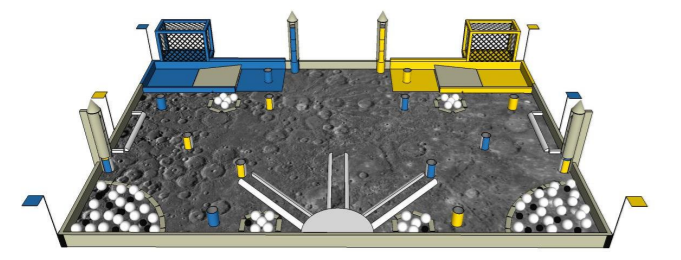

# Calcul de la position réelle du robot

Le calcul de la position réelle est à réaliser en même temps que celui de l'asservissement en vitesse.

## Données

Nous disposons des données suivantes :
- ticks des codeuses
- angle du robot obtenu par un gyroscope, angle selon l'axe Z pour connaitre la direction
- le temps qu'il a fallu pour se retrouver à une position donnée

A partir du nombre de ticks, on calcule la vitesse du robot.

On place l'origine de l'axe x,y en bas à gauche du plateau. On place le plateau comme dans l'image ci-après, avec la zone de départ bleue placée en haut à gauche. 
 
L'axe y est dirigé vers la zone de départ bleue. L'axe x est dirigé vers le coin  cratère de minerai jaune.

## Equations

|Donnée|Nom de la variable|
|---|---|
|Angle fourni par le giroscope|a|
|Distance parcourue |d|
|Distance parcourue selon l'axe x |x|
|Distance parcourue selon l'axe y |y|
|Durée écoulée pour parcourir d|temps|

- d = vitesse/temps
- x = d*cos(a)
- y = d*sin(a)
